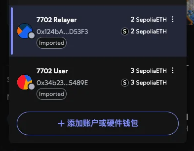
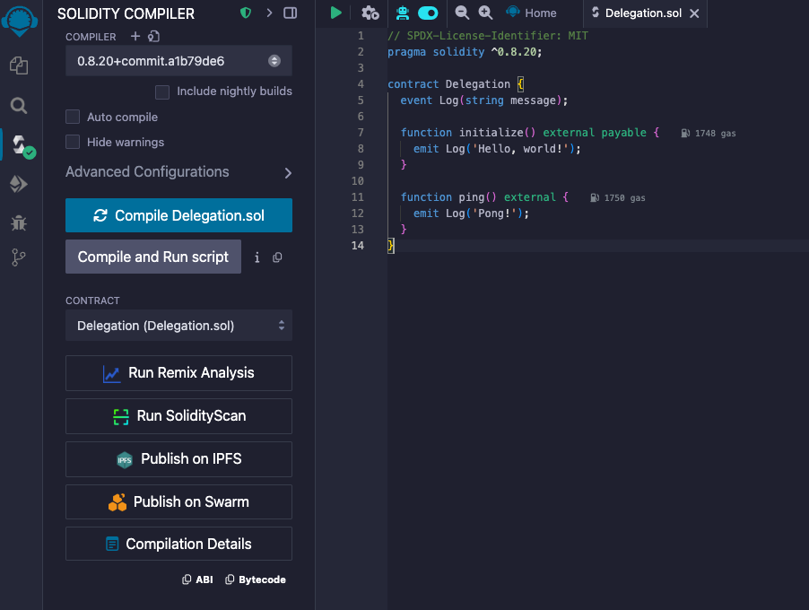
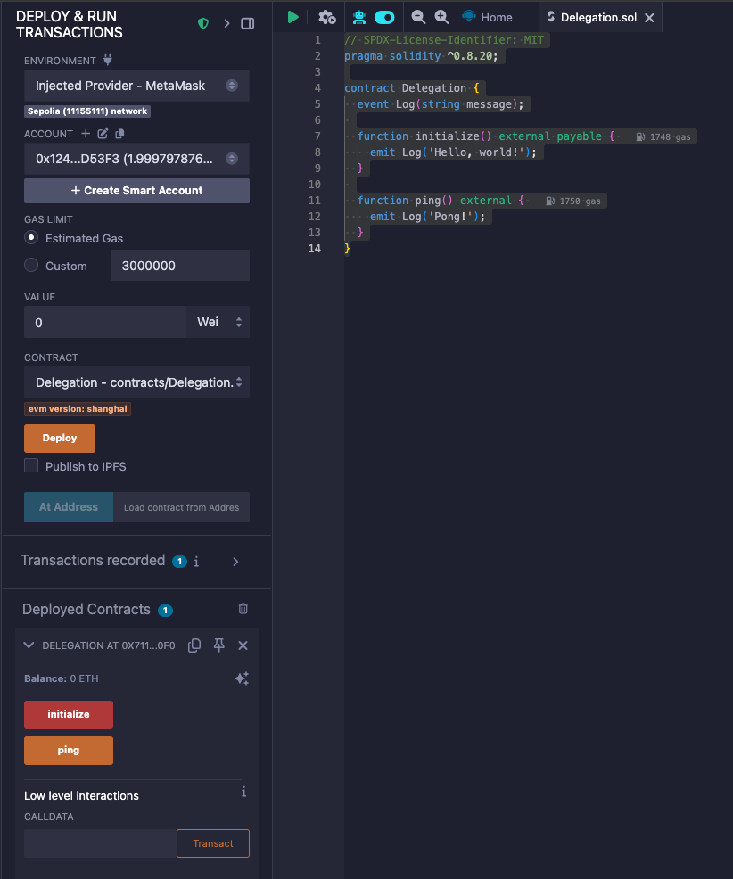
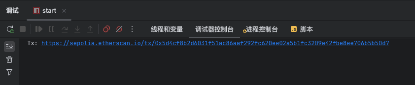
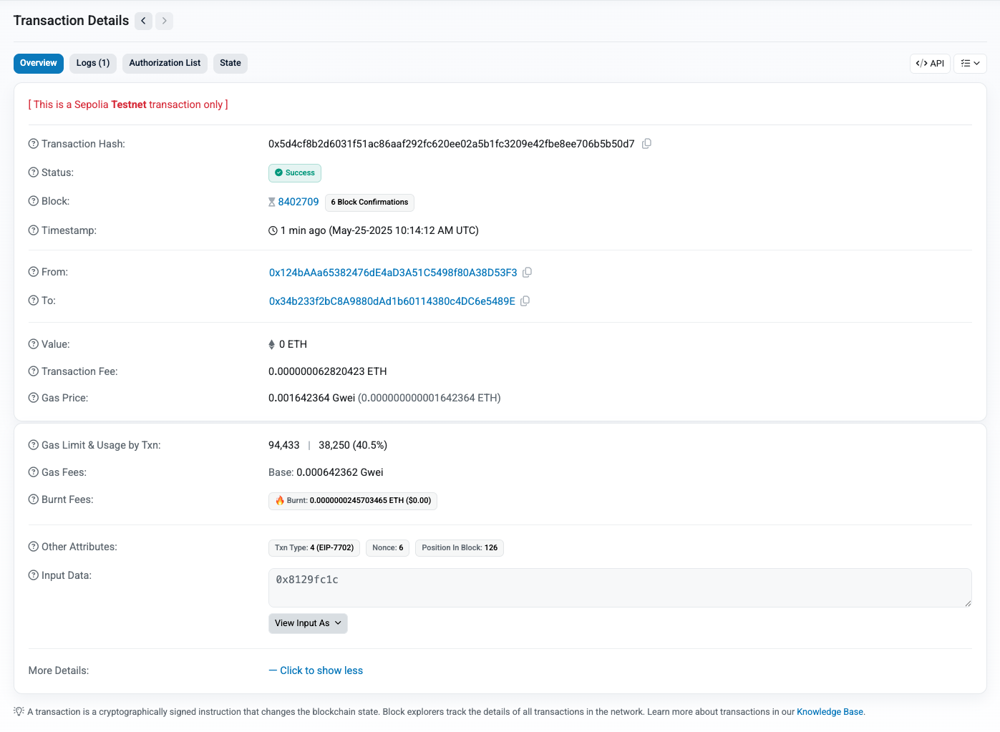
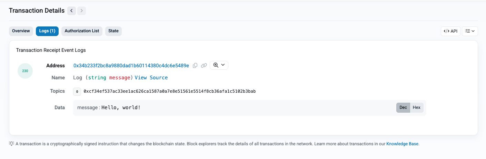
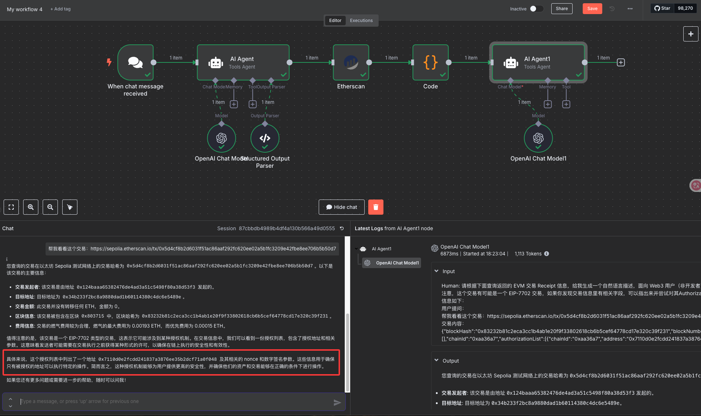

# 第四篇：Hello, EIP-7702

# 0x00 前言

随着以太坊 Pectra 升级的完成，EIP-7702 正式进入大众视野，围绕它的讨论与关注迅速升温。近期我对以太坊生态关注较少，所以关于 EIP-7702 了解的并不多。不过，在阅读了一些对该提案进行深入解析的文章后，我意识到其中也许蕴藏着新的机会。于是，便抽空对其进行了初步的了解和思考，并亲自体验了一次 EIP-7702 的交易。

本文将会对 EIP-7702 做一个简单介绍，然后通过实践的方式带大家直观地感受该提案带来的改变，本文约 3500 字，预计阅读时间在 10-15 分钟左右，适合对以太坊新技术感兴趣的开发者和爱好者。

# 0x01 EIP-7702 介绍

网上已经有大量关于 EIP-7702 的介绍，作为一个半路上手的初学者，我只能基于目前的理解，对它做一个简要的说明。如果大家想深入了解更权威或更系统的内容，建议参考社区中的其他技术文章或官方提案文档。

在介绍 EIP-7702 之前，我们先简单了解一下以太坊中的账户体系。以太坊中的账户分为两类：**EOA（Externally Owned Account，外部拥有账户）** 和 **合约账户（Contract Account）**。

EOA 是由私钥控制的账户，通常我们使用钱包（如 MetaMask）生成的地址就是一个 EOA。它本身不包含代码，只记录余额，主要用于主动发起操作，比如发送转账或调用合约。它无法像合约那样“被调用”或自动响应其他账户的操作，是一种非常“被动”的账户类型。相比之下，合约账户内部含有代码，可以根据外部传入的调用信息自动执行逻辑，是以太坊智能化的核心组成部分。

而 **EIP-7702 的核心创新**，就是让原本“被动”的 EOA 也具备临时的代码执行能力。

具体来说，EIP-7702 允许一个 EOA 在某笔交易中“加载”一段已经部署的智能合约代码，从而具备执行该代码逻辑的能力。这意味着，EOA 不再只是主动发起交易的参与者，也可以像合约一样，在特定上下文中**被其他人调用**，实现更复杂的交互逻辑。

举个例子，我可以部署一个“批量取消 ERC20 授权（approve）”的合约逻辑，某个用户（EOA）通过 EIP-7702 机制将这段逻辑加载到自己账户中，这样其他人就可以像调用合约一样去调用这个 EOA 的“解除授权”功能，从而一笔交易内批量取消多个 ERC20 的授权操作，用户本身不需要主动操作任何复杂内容。

上面的理解只是我对 EIP-7702 的初步认识，可能仍有不准确之处，欢迎大家指正或补充。

# 0x02 Hello World

看完前面的介绍，也许你和我一样，感觉对 EIP-7702 是**似懂非懂**——概念上大致明白，但仍然不够直观。那么接下来，不如我们亲自动手写一笔 **EIP-7702 的 Hello World 交易**，以代码的方式深入理解它的实际使用方式！

其实，EIP-7702 早已被一些主流的 Web3 库所支持，并配备了完善的开发文档。因此，如果你想动手实践，过程是非常方便快捷的。

在这个例子中，我们将使用 [`viem`](https://viem.sh/) 来发起一笔基于 EIP-7702 的交易。官方文档提供了非常清晰的教程，我们只需要按照它的步骤操作，就可以顺利完成属于你的第一笔 EIP-7702 交易。

参考教程：https://viem.sh/docs/eip7702/contract-writes

让我们开始动手实践吧！

## 1. 钱包准备

首先，先创建两个钱包，并确保他们在 Sepolia 测试网有资金，然后导出他们的私钥，记录下来备用。

这里，我们定义其中一个钱包是 User，这个是我们智能合约需要挂载到的地址，另外一个是 Relayer，用于实际发起交易的，同时，我们也用这个钱包来部署我们的智能合约。



## 2. 合约准备

接下来，我们编写一个要挂载到 User 钱包的智能合约代码，代码如下：

```solidity
// SPDX-License-Identifier: MIT
pragma solidity ^0.8.20;

contract Delegation {
  event Log(string message);
 
  function initialize() external payable {
    emit Log('Hello, world!');
  }
 
  function ping() external {
    emit Log('Pong!');
  }
}
```

这个合约内容非常简单，不做过多解释。我们使用 Relayer 钱包，在 https://remix.ethereum.org/ 上把这个智能合约部署到 Sepolia 测试网上：





复制智能合约的 ABI 和地址，比如我的地址是：`0x7110D0E2fcdD241837A3876EE35b2dCf71a0F048`

## 3. 搭建工程

在你的项目目录下搭建一个新的 Node 工程，目录结构如下：

```bash
├── src/
│   ├── config.ts
│   ├── contract.ts
│   └── index.ts
└── package.json
└── tsconfig.json
```

其中，每个文件内容如下：

- `package.json`
    
    ```json
    {
      "name": "eip7702-example",
      "version": "1.0.0",
      "description": "EIP-7702 contract writes example using viem",
      "main": "dist/index.js",
      "type": "commonjs",
      "scripts": {
        "build": "tsc",
        "start": "npm run build && node dist/index.js"
      },
      "keywords": [
        "ethereum",
        "eip7702",
        "viem",
        "smart-contract"
      ],
      "author": "",
      "license": "ISC",
      "packageManager": "pnpm@10.9.0",
      "dependencies": {
        "viem": "^2.0.0"
      },
      "devDependencies": {
        "@types/node": "^20.17.50",
        "typescript": "^5.3.3"
      }
    }
    ```
    
- `tsconfig.json`
    
    ```json
    {
      "compilerOptions": {
        "target": "es2016",
        "module": "commonjs",
        "resolveJsonModule": true,
        "esModuleInterop": true,
        "forceConsistentCasingInFileNames": true,
        "strict": true,
        "skipLibCheck": true,
        "outDir": "./dist"
      },
      "include": ["src/**/*"],
      "exclude": ["node_modules", "dist"]
    }
    ```
    
- `config.ts`
    
    ```tsx
    import { createWalletClient, http, WalletClient } from 'viem'
    import { sepolia } from 'viem/chains'
    import { privateKeyToAccount } from 'viem/accounts'
    
    export const relay = privateKeyToAccount('<你的 Ralyer 钱包私钥>')
    
    export const walletClient = createWalletClient({
      account: relay,
      chain: sepolia,
      transport: http(),
    })
    ```
    
- `contract.ts`
这里是你前面部署合约的 ABI 和地址
    
    ```tsx
    export const abi = [
      {
        "type": "function",
        "name": "initialize",
        "inputs": [],
        "outputs": [],
        "stateMutability": "pure"
      },
      {
        "type": "function",
        "name": "ping",
        "inputs": [],
        "outputs": [],
        "stateMutability": "pure"
      },
    ] as const
    
    export const contractAddress = '0x7110D0E2fcdD241837A3876EE35b2dCf71a0F048'
    ```
    
- `index.ts`
    
    ```tsx
    import { privateKeyToAccount } from 'viem/accounts'
    import { walletClient } from './config'
    import { abi, contractAddress } from './contract'
    
    const eoa = privateKeyToAccount('<你的 User 钱包私钥>')
    
    async function main() {
    
      // 1. Authorize designation of the Contract onto the EOA.
      const authorization = await walletClient.signAuthorization({
        account: eoa,
        contractAddress,
      })
    
      // 2. Designate the Contract on the EOA, and invoke the
      //    `initialize` function.
      const hash = await walletClient.writeContract({
        abi,
        address: eoa.address,
        authorizationList: [authorization],
        //                  ↑ 3. Pass the Authorization as a parameter.
        functionName: 'initialize',
      })
    
      console.log(`Tx: https://sepolia.etherscan.io/tx/${hash}`)
    }
    
    main().then().catch(e => console.error("Error", e))
    ```
    

## 4. 启动

执行 `npm run start` 启动，如果一切顺利，控制台将会输出一个交易链接，点击即可打开区块链浏览器查看交易具体信息：



这是我的交易：[https://sepolia.etherscan.io/tx/0x5d4cf8b2d6031f51ac86aaf292fc620ee02a5b1fc3209e42fbe8ee706b5b50d7](https://sepolia.etherscan.io/tx/0x5d4cf8b2d6031f51ac86aaf292fc620ee02a5b1fc3209e42fbe8ee706b5b50d7)





其中，这里的 `0x124b…53F3` 是我的 Relayer 钱包，`0x34b2….489E` 是我的 User 钱包，他们都是 EOA 钱包。但是 Relayer 通过调用 User，成功让他输出了一个 `Hello, world!` 的 `Log` 事件！和调用智能合约一样！

另外，根据我上一篇文章（[第三篇：AI 工作流工具 —— n8n 学习笔记：链上交易查询节点搭建](https://www.notion.so/AI-n8n-1fc48ee5ba8d80d6ad7bc783782555f8?pvs=21) ）实现的交易分析工作流，也可以分析出来这是一个 EIP-7702 的交易 😎（两篇文章这就连起来了）



## 5. 代码分析

上面给出了所有的代码，但我们还没对它们做分析，其实这些代码确实也比较简单。我们挑几个重点进行说明：

### `config.ts` —— 配置 Relayer 钱包并连接 Sepolia 区块链

这个文件中我们创建了一个钱包客户端 `walletClient`，代表中继账户（relay）连接到 Sepolia 测试网络。

```tsx
import { createWalletClient, http } from 'viem'
import { sepolia } from 'viem/chains'
import { privateKeyToAccount } from 'viem/accounts'

export const relay = privateKeyToAccount('<你的 Ralyer 钱包私钥>')

export const walletClient = createWalletClient({
  account: relay,
  chain: sepolia,
  transport: http(),
})
```

中继的作用是代表用户发起交易。在 EIP-7702 场景中，用户只负责签名授权，真正广播交易的是 relay。

前面通过实践不难得知，User 钱包是不发交易的（实际上，User 钱包也不需要准备资金），我们的交易是可以由 Relayer 代表用户发出，这是 EIP-7702 的特性之一。

在实际使用中，用户可以将授权信息签名给 Relayer，由 Relayer 发起交易。这也为 Account Abstraction 相关的 use case（如 Gas 代付）打开了大门。

### 使用 `signAuthorization` 完成授权签名

`eoa` 是用户的钱包地址，我们使用它来签名授权。它是一个普通的 EOA，不具备合约能力，但在 EIP-7702 的机制下，可以“临时拥有”合约逻辑。

用户（eoa）通过这行代码生成一份授权签名，表示允许在接下来的交易中加载指定合约的逻辑。

```tsx
const eoa = privateKeyToAccount('<你的 User 钱包私钥>')

const authorization = await walletClient.signAuthorization({
  account: eoa,
  contractAddress,
})
```

这里的 `contractAddress` 是你提前部署好的逻辑合约地址。这个签名不是发起交易，而是告诉链：**“我同意这段代码在本次交易中绑定到我身上”**。

### 使用 `writeContract` 调用 EOA（不是合约）

这一行是整个交易的核心调用：我们并不是调用一个合约地址，而是将调用目标设置为 `eoa.address` —— 用户自己。

```tsx
const hash = await walletClient.writeContract({
  abi,
  address: eoa.address,
  authorizationList: [authorization],
  functionName: 'initialize',
})
```

这里最关键的是：

- `address: eoa.address`：调用目标是 EOA。
- `authorizationList: [authorization]`：使用前面签好的授权，告诉链可以“挂载”合约逻辑。
- `functionName: 'initialize'`：要执行的函数是合约里的 `initialize`。

最终链上的效果是：一个普通的 EOA，在本笔交易中，被当作一个合约来调用了。

### 合约中的 `initialize` 函数

合约代码中没有构造函数，而是定义了一个普通的 `initialize` 函数用于演示调用行为。EIP-7702 本身不部署新合约，只是临时借用逻辑，因此使用 `initialize` 而不是 constructor。

```tsx
export const abi = [
  {
    "type": "function",
    "name": "initialize",
    "inputs": [],
    "outputs": [],
    "stateMutability": "pure"
  },
  {
    "type": "function",
    "name": "ping",
    "inputs": [],
    "outputs": [],
    "stateMutability": "pure"
  },
] as const
```

你也可以尝试将 `functionName` 改为 `'ping'`，再执行一次 `writeContract`，看是否能成功调用另一个函数。

# 0x03 未来可能的机会

前面的 Hello World 虽然非常简单，实际上也确实没啥作用。但是光看“EOA 钱包能具备智能合约功能”这一点，就足够引起我们的遐想——未来每个账号能拥有更加灵活、智能的行为能力，而不仅仅是简单的转账和调用合约。

我们可以预见，这将开启一系列全新的可能：

- 每个 EOA 都可以临时加载不同的合约逻辑，实现多样化的操作，像是“按需安装插件”的钱包。这意味着用户不必为每个功能都部署新的合约钱包，而是通过授权，灵活调用不同的合约模块。
- 结合 AI 技术，钱包可以变得更加智能化。AI 可以根据用户需求，自动生成或选择合约逻辑，完成批量操作、资产管理、自动化交易等复杂行为，真正实现“智能钱包助理”的愿景。
- 交易执行将变得更加高效和轻量。用户无需承担每次操作都部署合约的成本，也不用依赖复杂的智能合约钱包架构，只需授权即可完成各种高级操作。
- 未来，AI 可以成为用户账户的“行为代理”，通过自然语言指令驱动链上交互，自动完成授权、调用合约、批量管理资产等任务。结合 EIP-7702，这些操作将更便捷、安全，极大提升用户体验。
- 这一机制也能助力构建更开放的链上生态。开发者只需提供通用的合约模块，用户则可以根据自身需求自由组合使用，无需重复部署，极大降低开发和使用门槛。

简言之，EIP-7702 让 EOA 从传统的“单一身份”变成了一个“可扩展的智能实体”，这不仅是技术上的突破，更可能催生下一代更智能、更灵活的链上钱包和交互方式。

# 0x04 总结

EIP-7702 的出现为以太坊账户体系带来了突破性的变化。它打破了传统上 EOA 只能被动发起交易、无法执行代码的限制，让普通账户具备了临时加载和执行智能合约代码的能力。这不仅丰富了账户的交互方式，也为开发者和用户打开了许多新的想象空间。

本文主要通过亲自动手发起一个 Hello World 交易的方式，从工程侧带大家更加直观地了解 EIP-7702。但由于我对 EIP-7702 了解仍不够深入，并未对其背后实现原理做出太详细的说明。如果大家对背后原理感兴趣，推荐阅读网上的其他资料，文末也会列出我在撰写本文时阅读过的部分参考资料。

未来，基于 EIP-7702 的功能，我们可以预见更多创新的用例出现。例如，账户自身能够实现灵活的权限管理、批量操作、身份验证、甚至 AI 驱动的智能账户行为。这些都将推动以太坊生态向更加智能化和用户友好的方向发展。

总之，EIP-7702 是一次重要的协议升级，值得开发者和社区持续关注与探索。希望本文能为你打开一扇了解和实践这项新技术的窗户，期待大家共同见证它带来的更多可能！

# 0x05 参考资料

1. OKX研究院 | 账户抽象10年演进终局之战，透过EIP-7702看过去与未来：[https://mp.weixin.qq.com/s/zahI4PUuWQBdCXq0doByMw](https://mp.weixin.qq.com/s/zahI4PUuWQBdCXq0doByMw)
2. 以太坊 - EIP-7702 介绍：[https://zhuanlan.zhihu.com/p/1897389746663187513](https://zhuanlan.zhihu.com/p/1897389746663187513)
3. Contract Writes with EIP-7702：[https://viem.sh/docs/eip7702/contract-writes](https://viem.sh/docs/eip7702/contract-writes)

第五篇，完🎉